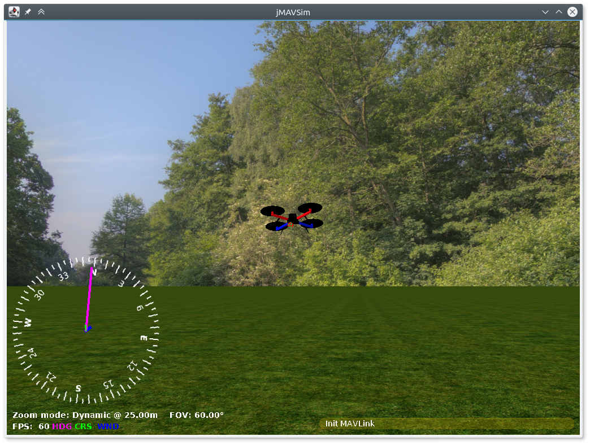

[](https://travis-ci.org/PX4/jMAVSim)

Simple multirotor simulator with MAVLink protocol support



### Installation ###

Requirements:
 * Java 8 or newer (JDK, http://www.oracle.com/technetwork/java/javase/downloads/index.html)

 * Java3D and JOGL/JOAL jars, including native libs for Linux (i586/64bit), Windows (i586/64bit) and Mac OS (universal) already included in this repository, no need to install it.

 * libvecmath-java (for ubuntu)

Clone repository and initialize submodules:
```
git clone https://github.com/PX4/jMAVSim.git
git submodule init
git submodule update
```

Install prerequisites via HomeBrew:

```
brew install ant
```

Create a standalone runnable JAR file with all libraries included, copy supporting resources, and use a shorter command to execute:

```
ant create_run_jar copy_res
cd out/production
java -Djava.ext.dirs= -jar jmavsim_run.jar [any jMAVSim options]
```

To create a complete package ready for distribution, build the `distro` target (this will create `out/production/jMAVSim-distrib.zip`):

```
ant distro
```

To delete everything in the build folder `ant clean-all`.

#### Alternate build / run / distribute

Compile:
```
ant
```

Run:
```
java -cp lib/*:out/production/jmavsim.jar me.drton.jmavsim.Simulator
```

Some shells (e.g. tcsh) will try to expand `*`, so use `\*` instead:
```
java -cp lib/\*:out/production/jmavsim.jar me.drton.jmavsim.Simulator
```

On **Windows** use `;` instead of `:` in -cp:
```
java -cp lib/*;out/production/jmavsim.jar me.drton.jmavsim.Simulator
```

#### Key command ####

Views:
-    F    - First-person-view camera.
-    S    - Stationary ground camera.
-    G    - Gimbal camera.
-    Z    - Toggle auto-zoom for Stationary camera.
-   +/-   - Zoom in/out
- 0/ENTER - Reset zoom to default.

Actions:
-   Q   - Disable sim on MAV.
-   I   - Enable sim on MAV.
-   H   - Toggle HUD overlay.
-   C   - Clear all messages on HUD.
-   R   - Toggle data report sidebar.
-   T   - Toggle data report updates.
-   D   - Toggle sensor parameter control sidebar.
-   F1  - Show this key commands reference.
-   P   - Pause.
-  ESC  - Exit jMAVSim.
- SPACE - Reset vehicle & view to start position.

Manipulate Vehicle:
-  ARROW KEYS      - Rotate around pitch/roll.
-  END/PG-DN       - Rotate CCW/CW around yaw.
-  SHIFT + ARROWS  - Move N/S/E/W.
-  SHIFT + INS/DEL - Move Up/Down.
-  NUMPAD 8/2/4/6  - Start/increase rotation rate around pitch/roll axis.
-  NUMPAD 1/3      - Start/increase rotation rate around yaw axis.
-  NUMPAD 5        - Stop all rotation.
-  CTRL + NUMPAD 5 - Reset vehicle attitude, velocity, & accelleration.

Manipulate Environment:
- ALT +
    - ARROW KEYS      - Increase wind deviation in N/S/E/W direction.
    - INS/DEL         - Increase wind deviation in Up/Down direction.
    - NUMPAD 8/2/4/6  - Increase wind speed in N/S/E/W direction.
    - NUMPAD 7/1      - Increase wind speed in Up/Down direction.
    - NUMPAD 5        - Stop all wind and deviations.

- CTRL+ Manipulate - Rotate/move/increase at a higher/faster rate.

### Troubleshooting ###

#### Java 3D

jMAVSim uses java3d library for visualization.
It was discontinued for long time, but now maintained again and uses JOGL backend.
All necessary jars with java classes and native binaries (Linux/Mac OS/Windows) included in this repo, no need to install java3d manually.
But need to make sure that java doesn't use any other deprecated version of java3d.
For more info related to java3d see this article: https://gouessej.wordpress.com/2012/08/01/java-3d-est-de-retour-java-3d-is-back/

On **Mac OS** java may use deprecated version of java3d as extension, if you get following error:
```
JavaVM WARNING: JAWT_GetAWT must be called after loading a JVM
AWT not found
Exception in thread "main" java.lang.NoClassDefFoundError: apple/awt/CGraphicsDevice
	at javax.media.j3d.GraphicsConfigTemplate3D.<clinit>(GraphicsConfigTemplate3D.java:55)
...
```

Then add `-Djava.ext.dirs=` option to command line when starting:
```
java -Djava.ext.dirs= -cp lib/*:out/production/jmavsim.jar me.drton.jmavsim.Simulator
```

#### Serial port

Serial port access is common problem. Make sure to hardcode correct port in Simulator.java:
```
serialMAVLinkPort.open("/dev/tty.usbmodem1", 230400, 8, 1, 0);
```
(Baudrate for USB ACM ports (that PX4 uses) has no effect, you can use any value)

Usually port is:
```
Mac OS: /dev/tty.usbmodem1
Linux: /dev/ttyACM0
Windows: COM15
```

On **Linux** you may also get `Permission denied` error, add your user to `dialout` group and relogin, or just run as root.

#### UDP

UDP port used to connect ground station, e.g. qgroundcontrol.
jMAVSim in this case works as bridge between ground station and autopilot (behavior can be configured of course).
Make sure that jMAVSim and ground station use the same ports.
In qgroundcontrol (or another GCS) you also need to add target host in UDP port configuration (localhost:14555), so both ends will know to which port they should send UDP packets.

### Development ###

The simulator configuration is hardcoded in file `src/me/drton/jmavsim/Simulator.java`. Critical settings like port names or IP addresses can be provided as commandline arguments.

New vehicle types (e.g. non standard multirotors configurations) can be added very easily.
(But for fixed wing you will need some more aerodynamics knowledge).
See files under `src/me/drton/jmavsim/vehicle/` as examples.

The camera can be placed on any point, including gimabal, that can be controlled by autopilot, see `CameraGimbal2D` class and usage example (commented) in Simulator.java.

Sensors data can be replayed from real flight log, use `LogPlayerSensors` calss for this.

Custom vehicle visual models in .obj format can be used, edit this line:
```
AbstractMulticopter vehicle = new Quadcopter(world, "models/3dr_arducopter_quad_x.obj", "x", 0.33 / 2, 4.0, 0.05, 0.005, gc);
```

Custom MAVLink protocols can be used, no any recompilation needed, just specify XML file instead of `custom.xml` here:
```
MAVLinkSchema schema = new MAVLinkSchema("mavlink/message_definitions/common.xml");
```

It's convenient to start the simulator from IDE. Free and powerful "IntelliJ IDEA" IDE recommended, project files for it are already included, just open project file `jMAVSim.ipr` and right-click -> Run `Simulator`.


### Exporting 3D vehicle models using Blender

For custom vehicles it might be desirable to export new 3D models. One way of doing so is using [Blender](https://www.blender.org/). To import an existing model from another application into blender, (e.g. [onshape](https://cad.onshape.com)), export to the Collada (`.dae`) file format.

Once the Collada file has been imported into blender, it is necessary to set the *Ambient* value in the shading property to `0.0` for all materials used. A value of `1.0` will produce white surfaces in jMAVSIM regardless of the material settings.

When exporting from Blender, choose the `Wavefront (.obj)` file format. In the export dialogue, make the following changes:
* Adjust the orientation of the model by specifying the `Forward` and `Up` directions. For example, if the z-axis in the Blender scene is pointing upwards, the correct setting for `Up:` would be `-Z up` for jMAVSIM.
* Deselect "Objects as OBJ Objects" and select "Objects as OBJ Groups" instead. Otherwise jMAVSim will fail parsing the 3D model.
